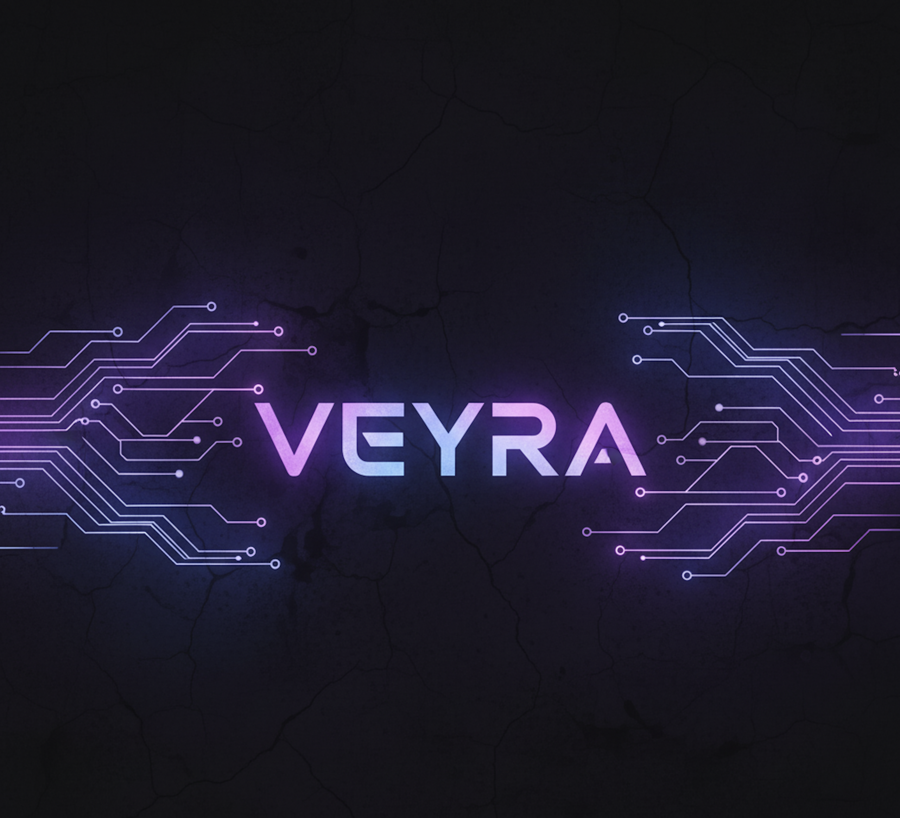

# Veyra Discord RPG Bot — Comprehensive Documentation




> **A comprehensive Discord RPG bot featuring economy, combat, crafting, and social systems — all designed to simulate a living world inside your server.**

---

## Table of Contents

1. [Overview](#overview)
2. [Getting Started](#getting-started)
3. [Core Systems](#core-systems)
   - [Registration & Onboarding](#registration--onboarding)
   - [Economy System](#economy-system)
   - [Inventory System](#inventory-system)
   - [Shop & Marketplace](#shop--marketplace)
   - [Combat System](#combat-system)
   - [Jobs System](#jobs-system)
   - [Crafting & Upgrades](#crafting--upgrades)
   - [Lootbox System](#lootbox-system)
   - [Quest System](#quest-system)
   - [Experience & Leveling](#experience--leveling)
   - [Friendship System](#friendship-system)
   - [Mini-Games](#mini-games)
   - [Gambling & Racing](#gambling--racing)
4. [Items & Rarities](#items--rarities)
5. [Weapons & Spells](#weapons--spells)
6. [Command Reference](#command-reference)
7. [Developer Reference](#developer-reference)
8. [System Interactions](#system-interactions)
9. [Gameplay Loops](#gameplay-loops)

---

## Overview

**Veyra** is a modular, AI-integrated Discord bot that combines utility, RPG systems, social simulation, and procedural dialogue. The bot is built using:

- **Language:** Python 3.11
- **Framework:** Pycord (py-cord 2.6.1)
- **ORM:** SQLAlchemy 2.0
- **Database:** PostgreSQL
- **Scheduler:** APScheduler (for background jobs)

### Key Features

| Feature | Description |
|---------|-------------|
| **Economy** | Gold-based currency with wallets, transfers, and dynamic pricing |
| **Combat** | Turn-based 1v1 PvP and PvE campaign battles with weapons/spells |
| **Marketplace** | Player-driven trading with escrow and fee systems |
| **Jobs** | Energy-based work system with rewards (knight, digger, miner, thief) |
| **Crafting** | Ore smelting with upgradable buildings |
| **Lootboxes** | Tiered reward boxes with rarity-based drops |
| **Quests** | Delivery quests with streak bonuses |
| **Mini-Games** | Wordle solver, number guessing, coin flip, animal racing |
| **Friendship** | Relationship leveling with Veyra through interactions |
| **AI Chat** | GPT-based conversational AI (WIP) |

---

## Getting Started

### Installation

```bash
git clone https://github.com/Sylver-Icy/Veyra.git
cd Veyra
pip install -r requirements.txt
```

### Configuration

1. Create a `veyra.env` file with the following:
   ```env
   DISCORD_TOKEN=your_discord_bot_token
   # PostgreSQL connection details
   DATABASE_URL=your_postgresql_connection_string
   ```

2. Set up your PostgreSQL database and run the schema migrations.

3. Start the bot:
   ```bash
   python veyra.py
   ```

### First Steps for Players

1. Use `!helloVeyra` to register and become friends with Veyra
2. Complete the interactive tutorial (guided step-by-step)
3. Use `/help` or `!commandhelp <command>` for assistance

---

## Core Systems

### Registration & Onboarding

#### How It Works

Players must register before using most commands. Registration is handled through the `!helloVeyra` command.

**Registration Process:**
1. Player uses `!helloVeyra`
2. Veyra asks "Wanna be frnds with me? (Yes/No)"
3. If "Yes": Player is registered with:
   - A new user record in the database
   - An empty wallet
   - 2× Bag of Gold (item ID 183) as a starter gift
   - 150 starting energy
4. A guided tutorial begins

**Tutorial Flow:**
The tutorial system (`tutorial_services.py`) guides new players through:

| State | Task | Description |
|-------|------|-------------|
| NOT_STARTED | - | Initial state |
| CHECK_WALLET | `!check wallet` | Learn to check your gold |
| PLAY | `!play` | Play the number guessing game |
| OPEN_SHOP | `/shop` | View the shop system |
| WORK | `!work <job>` | Perform your first job |
| COMPLETED | - | Tutorial finished |

**Technical Details:**
- User state stored in `users.tutorial_state` column
- Tutorial guards block commands until the current step is completed
- Tutorial can be bypassed by setting `tutorial_state = -1`

---

### Economy System

The economy is gold-based with multiple sources and sinks to maintain balance.

#### Gold Sources
- **Jobs:** Knight (40-90g), Digger (20g + lootboxes), Miner (25g + ores), Thief (10% steal)
- **Quests:** Delivery rewards (10-1200g based on rarity/streak)
- **Lootboxes:** Gold drops (3-500g based on tier)
- **Marketplace sales:** Sell items to other players
- **Shop buyback:** Sell items to the daily shop
- **Battle victories:** Winner takes 90% of total pot
- **Racing winnings:** Proportional payout from prize pool
- **Usable items:** Bag of Gold grants 100g
- **Campaign rewards:** Gold rewards for clearing stages

#### Gold Sinks
- **Shop purchases:** Buy items from daily shop
- **Marketplace purchases:** Buy from player listings
- **Battle bets:** Entry stakes for PvP
- **Racing bets:** Wagers on animal races
- **Transfer fees:** 5% fee on gold transfers
- **Marketplace fees:** 7% seller fee on sales
- **Building purchases:** Unlock/upgrade crafting buildings
- **Smelting costs:** Coal consumed during crafting

#### Key Functions

| Function | Description |
|----------|-------------|
| `add_gold(user_id, amount)` | Add gold to user's wallet |
| `remove_gold(user_id, amount)` | Remove gold (raises error if insufficient) |
| `check_wallet(user_id)` | Returns current gold balance |
| `get_richest_users(limit)` | Returns top N users by gold |

#### Leaderboard

A `/leaderboard` command shows the top 10 richest users. Weekly leaderboards are posted automatically every Sunday at midnight UTC.

---

### Inventory System

Players can collect, trade, and use items stored in their inventory.

#### Item Properties

Each item in the database (`items` table) has:

| Property | Description |
|----------|-------------|
| `item_id` | Unique identifier |
| `item_name` | Display name |
| `item_description` | Flavor text |
| `item_rarity` | Common, Rare, Epic, Legendary, Paragon |
| `item_icon` | Emoji or image reference |
| `item_price` | Base value |
| `item_usable` | Whether the item can be consumed |
| `item_durability` | *Optional* durability stat (currently unused) |

#### Inventory Commands

| Command | Description |
|---------|-------------|
| `!check inventory` | View your items (paginated) |
| `!info <item>` | Get detailed info about any item |
| `!use <item>` | Use a consumable item |
| `/transfer_item` | Give items to another player |

#### Usable Items

Defined in `utils/usable_items.py`:

| Item | Effect |
|------|--------|
| Potion of EXP | +500 EXP |
| Jar of EXP | +2000 EXP |
| Bag of Gold | +100 Gold |
| Hint Key | Activates hint in number guessing game |

#### Item Name Resolution

The system uses fuzzy matching (`rapidfuzz`) to suggest corrections for misspelled item names. Item name-to-ID mapping is cached in `utils/itemname_to_id.py`.

---

### Shop & Marketplace

Veyra features two distinct trading systems:  a bot-run **Shop** and a player-driven **Marketplace**. 

#### Daily Shop

The shop rotates daily at midnight UTC with: 
- **Sell Section:** 6 random items (Common/Rare/Epic) that players can buy
- **Buyback Section:** 5 items (Common/Rare/Epic/Legendary) that players can sell
  - The 5th item has a 1. 3-2. 2x bonus multiplier on its price

**Shop Pricing:**

| Rarity | Buy Price Range | Buyback Range |
|--------|-----------------|---------------|
| Common | 5-10g | 5-10g |
| Rare | 15-22g | 15-22g |
| Epic | 50-70g | 50-70g |
| Legendary | 200-280g | 200-280g |
| Paragon | 600-900g | 600-900g |

**Shop Commands:**

| Command | Description |
|---------|-------------|
| `/shop` | View today's shop (shows both sections) |
| `!buy <item> <qty>` | Purchase items from the sell section |
| `!sell <item> <qty>` | Sell items to the buyback section |

#### Player Marketplace

The marketplace allows players to create listings for other players to buy. 

**How It Works:**
1. **Creating a listing:** Items are taken from your inventory and held in escrow
2. **Buying:** Buyer pays gold → seller receives 93% (7% fee) → buyer gets items
3. **Deleting:** Items are refunded to the seller's inventory

**Marketplace Commands:**

| Command | Description |
|---------|-------------|
| `/create_listing` | List items for sale (2 listings per hour) |
| `/loadmarketplace` | Browse all active listings |
| `/buy_from_marketplace <id> <qty>` | Purchase from a listing |
| `/delete_listing <id>` | Remove your listing and refund items |

---

### Combat System

Veyra features a sophisticated turn-based combat system with PvP (1v1 battles) and PvE (campaign mode).

#### Battle Mechanics

**Core Stats:**

| Stat | Base Value | Description |
|------|------------|-------------|
| HP | 40 + weapon bonus | Health points; 0 = defeat |
| Attack | 5 + weapon bonus | Damage output |
| Defense | 0 + weapon bonus | Damage reduction percentage |
| Speed | 10 + weapon bonus | Turn order; affects block/counter success |
| Mana | 10 + weapon bonus | Required for casting spells |
| Frost | 0 | Accumulates; at 10, triggers 50% HP damage |

**Stances (Actions):**

Each round, players choose one of five stances:

| Stance | Description |
|--------|-------------|
| **Attack** | Deal damage based on Attack stat.  Increases Attack by 1 on hit. |
| **Block** | Reduce incoming damage by 70%. Gain defense on success.  Fails if too slow.  |
| **Counter** | Reflect 50% of damage if opponent attacks. Penalties if wrong guess. |
| **Recover** | Regenerate HP or Mana (alternates). Only works if opponent is defensive. |
| **Cast** | Use your equipped spell (costs Mana). |

**Stance Interactions Matrix:**

| P1 \ P2 | Attack | Block | Counter | Recover | Cast |
|---------|--------|-------|---------|---------|------|
| Attack | Both deal damage (faster goes first) | P1 blocked | P1 countered | P2 interrupted, takes damage | P2 casts if faster |
| Block | P1 blocks P2 | Both lose 7 HP | P1: -2 HP, P2: -4 speed | P2 recovers, P1 loses defense | P2 casts |
| Counter | P2 countered | P1: -4 speed, P2: -2 HP | Both lose 10 defense | P2 recovers, P1 penalized | P2 casts |
| Recover | P1 interrupted | P1 recovers, P2 loses defense | P1 recovers, P2 penalized | Both fail | P2 casts |
| Cast | P1 casts | P1 casts | P1 casts | P1 casts | Faster caster wins; other loses 5 mana |

**Status Effects:**

| Effect | Duration | Per-Round Effect |
|--------|----------|------------------|
| Nightfall | 5 rounds | Random stat reduced by 2 |
| Large Heal | 4 rounds | Heal 4 HP per round |
| Frostbite | Accumulates | At 10 stacks:  50% current HP damage |
| Veil of Darkness | 4 rounds | Incoming attack damage reduced by 60% |

**Timeout Penalty:**
- If a player doesn't choose within 50 seconds:  -25 HP penalty
- Default action becomes "Attack"

#### PvP Battles

**Starting a Battle:**
```
/battle @opponent <bet_amount>
```

1.  Challenger's bet is deducted immediately
2. Target receives a challenge embed with Accept/Decline buttons
3. If accepted, target's bet is also deducted
4. Battle begins with alternating rounds
5. Winner receives 90% of total pot (10% Veyra fee)

**Loadout System:**
Players can customize their weapon and spell: 
```
/loadout <weapon> <spell>
```

#### PvE Campaign

Campaign Mode is a solo progression system where players fight against Veyra AI across 10 stages of increasing difficulty.  Each stage requires defeating Veyra to advance, with unique rewards granted upon completion.

**Starting a Campaign Battle:**
```
/campaign
```

**How Campaign Mode Works:**
- Players fight Veyra using their own loadout (weapon + spell)
- Veyra's loadout and stats are determined by your current campaign stage
- Combat uses the same turn-based mechanics as PvP battles
- Veyra is controlled by an AI that adapts its strategy based on its equipped weapon and your play patterns
- Defeat Veyra to advance to the next stage and claim rewards
- You cannot start a new campaign battle while already in an active battle

**Campaign Stages & Veyra's Loadout:**

| Stage | Veyra's Weapon | Veyra's Spell | Bonus HP | Bonus Mana |
|-------|----------------|---------------|----------|------------|
| 1 | Training Blade | Fireball | -25 | -5 |
| 2 | Moon Slasher | Frostbite | -10 | -2 |
| 3 | Training Blade | Erdtree Blessing | 0 | 0 |
| 4 | Moon Slasher | Frostbite | +5 | 0 |
| 5 | Elephant Hammer | Erdtree Blessing | +5 | 0 |
| 6 | Eternal Tome | Nightfall | +10 | +5 |
| 7 | Training Blade | Heavyshot | +15 | +5 |
| 8 | Dark Blade | Fireball | +15 | 0 |
| 9 | Moon Slasher | Frostbite | +15 | +10 |
| 10 | Veyra's Grimoire | Veil of Darkness | +10 | +5 |

**Campaign Rewards:**

| Stage | Reward |
|-------|--------|
| 1 | 40 Gold |
| 2 | 1× Wooden Box |
| 3 | 100 Gold |
| 4 | 250 Gold |
| 5 | 2× Stone Box |
| 6 | 4× Bag of Gold |
| 7 | 5× Hint Key |
| 8 | 2× Iron Box |
| 9 | 1× Platinum Box |
| 10 | **Unlocks Veyra's Grimoire & Veil of Darkness** |

**Campaign Completion:**
- Upon completing Stage 10, you unlock access to Veyra's signature weapon and spell for use in PvP battles
- Once completed, attempting `/campaign` will display a completion message
- Campaign progress is saved per-user in the database

**Tips for Campaign:**
- Early stages are easier with weaker Veyra stats (negative bonuses)
- Stage difficulty ramps up with Veyra gaining HP/Mana bonuses
- Study Veyra's weapon effects to anticipate her strategy (e.g., Moon Slasher builds Frost)
- The final stage (10) introduces campaign-exclusive equipment you'll earn upon victory

---

### Jobs System

Jobs are energy-based activities that generate resources. 

#### Energy System

- **Maximum Energy:** 35 + (15 × level)
- **Regeneration:** +1 energy every 6 minutes (via scheduled job)
- **Level-up bonus:** +15 energy on level up

#### Available Jobs

| Job | Energy Cost | Rewards | Notes |
|-----|-------------|---------|-------|
| **Knight** | 80 | 40-90 gold | Reliable gold income |
| **Digger** | 70 | Lootboxes or 20 gold | See drop rates below |
| **Miner** | 50 | Ores or 25 gold | See drop rates below |
| **Thief** | 60 | Steal 10% of target's gold | 50% success rate; -30g fine on fail |

**Digger Drop Rates:**
- Gold: 27%
- Wooden Box: 35%
- Stone Box: 25%
- Iron Box: 10%
- Platinum Box: 3%

**Miner Drop Rates:**
- Gold: 10%
- Coal: 27%
- Copper Ore: 30%
- Iron Ore: 21%
- Silver Ore: 12%

**Miner Ore Quantities:**
- Normal (93% chance): 3-6 ores
- Bonus (7% chance): 12-20 ores

**Commands:**
```
! work knight
!work digger
!work miner
!work thief @target
! check energy
```

---

### Crafting & Upgrades

#### Smelting

Convert raw ores into bars using the `/smelt` command.

**Smelting Recipes:**

| Bar | Required Ore | Ore Amount |
|-----|--------------|------------|
| Copper Bar | Copper Ore | 5 per bar |
| Iron Bar | Iron Ore | 5 per bar |
| Silver Bar | Silver Ore | 5 per bar |

**Coal Cost by Smelter Level:**

| Level | Allowed Bars | Coal per Bar |
|-------|--------------|--------------|
| 1 | Copper only | 5 |
| 2 | Copper, Iron | 4 |
| 3 | Copper, Iron | 4 |
| 4 | Copper, Iron | 3 |
| 5 | Copper, Iron, Silver | 3 |
| 6 | Copper, Iron, Silver | 2 |
| 7 | Copper, Iron, Silver | 1 |

**Bar Sell Prices:**
- Copper Bar:  50g
- Iron Bar:  150g
- Silver Bar: 450g

#### Building System

Players can unlock and upgrade buildings (currently:  Smelter).

**Commands:**
```
!unlock <building>    # Purchase a building (level 1)
!upgrade <building>   # Upgrade to next level (requires gold)
```

**Technical Details:**
- Building definitions stored in `upgrade_definitions` table
- User upgrades stored in `user_upgrades` table
- Each level has defined cost and effect description

---

### Lootbox System

Lootboxes contain gold and random items based on rarity tiers.

#### Lootbox Types

| Box | Gold Range | Rolls | Drop Rates |
|-----|------------|-------|------------|
| **Wooden** | 3-12g | 1-2 (85%/15%) | Common:  88%, Rare: 10%, Epic: 2% |
| **Stone** | 11-22g | 1-2 (60%/40%) | Common: 67%, Rare: 28%, Epic: 5% |
| **Iron** | 65-110g | 1-3 (13%/70%/17%) | Common: 48%, Rare: 35%, Epic: 17% |
| **Platinum** | 200-500g | 3-6 | Common: 15%, Rare: 50%, Epic: 31%, Legendary: 4% |

#### Item Quantities per Box/Rarity

| Box | Common | Rare | Epic | Legendary |
|-----|--------|------|------|-----------|
| Wooden | 1-2 | 1 | 1 | - |
| Stone | 1-3 | 1-2 | 1 | - |
| Iron | 2-5 | 1-3 | 1-2 | - |
| Platinum | 4-7 | 3-6 | 1-4 | 1 |

**Command:**
```
!open <box_name>
```

---

### Quest System

The quest system provides delivery missions with gold rewards.

#### How Quests Work

1. Use `/quest` to receive or view your current quest
2. Gather the requested items (1-2 random items)
3. Return to complete and receive rewards

**Quest Parameters:**
- **Item rarity pool:** Based on player level
  - Level 1-4: Common only
  - Level 5-9: Common, Rare
  - Level 10-14: Common, Rare, Epic
  - Level 15+: Common, Rare, Epic, Legendary

**Reward Calculation:**

| Rarity | Base Reward |
|--------|-------------|
| Common | 10-15g |
| Rare | 25-32g |
| Epic | 71-93g |
| Legendary | 181-321g |
| Paragon | 799-1211g |

Rewards are multiplied by: 
- Random bonus:  1.2-1.8x
- Streak multiplier (see below)

**Streak System:**

| Streak | Multiplier |
|--------|------------|
| 0-1 | 1.0x |
| 2-5 | 1.2x |
| 6-9 | 1.5x |
| 10+ | 2.0x |

**Skip System:**
- Up to 3 skips per day
- Skipping resets your streak
- Skips reset daily at midnight UTC

---

### Experience & Leveling

Players gain EXP through various activities and level up to unlock benefits.

#### EXP Sources

| Activity | EXP Gained |
|----------|------------|
| Chatting | 6-15 (30-second cooldown) |
| Command completion | +1 friendship (indirectly) |
| Potion of EXP | 500 |
| Jar of EXP | 2000 |

#### Level Thresholds

| Level | Total EXP Required |
|-------|-------------------|
| 1 | 0 |
| 2 | 100 |
| 3 | 250 |
| 4 | 400 |
| 5 | 600 |
| 6 | 900 |
| 7 | 1,250 |
| 8 | 1,600 |
| 9 | 2,200 |
| 10 | 3,000 |
| 11 | 4,200 |
| 12 | 5,500 |
| 13 | 7,000 |
| 14 | 9,000 |
| 15 | 12,000 |
| 16 | 15,000 |
| 17 | 18,000 |
| 18 | 22,000 |
| 19 | 27,000 |
| 20 | 32,000 |
| 21 | 38,000 |
| 22 | 48,000 |
| 23 | 60,000 |
| 24 | 78,000 |
| 25 | 100,000 |

#### Level-Up Benefits

- **Energy:** +15 max energy per level
- **Quests:** Higher-level players get access to rarer quest items

**Commands:**
```
!check exp
```

---

### Friendship System

Players build friendship with Veyra through interactions.

#### Earning Friendship EXP

| Action | Friendship EXP |
|--------|----------------|
| Complete any command | +1 |
| Transfer gold to Veyra | 1 per 10 gold (+ bonus 1) |
| Give items to Veyra | +9 per item |

**Daily Cap:** 50 friendship EXP per day (resets at midnight UTC)

#### Friendship Tiers

| EXP Required | Title |
|--------------|-------|
| 0 | Stranger |
| 100 | Acquaintance |
| 300 | Casual |
| 700 | Friend |
| 1,200 | Close Friend |
| 1,800 | Bestie |
| 2,500 | Veyra's favourite 💖 |

**Command:**
```
!helloVeyra   # Shows current friendship status
```

---

### Mini-Games

#### Number Guessing Game

**Command:** `!play`

**How It Works:**
1. Daily game (one attempt per day)
2. Progress through 4 stages with increasing difficulty
3. Guess the correct number within a range
4. Wrong guess = game over (or use Hint Key)

**Stage Difficulty:**

| Stage | Range Size | Example Range |
|-------|------------|---------------|
| 1 | 2 numbers | 50-51 |
| 2 | 4 numbers | 50-53 |
| 3 | 10 numbers | 50-59 |
| 4 | 15 numbers | 50-64 |

**Rewards by Exit Stage:**

| Exit Stage | Reward |
|------------|--------|
| 1 | 1× Wooden Box |
| 2 | 1× Stone Box |
| 3 | 3× Stone Box |
| 4 | 1× Iron Box + 1× Wooden Box |
| Win (all 4) | 1× Platinum Box + 1× Stone Box |

**Hint Key:**
- Use `!use Hint Key` during the game
- Next wrong guess reveals if answer is higher/lower instead of ending game
- Only works for one guess

#### Wordle Solver

**Commands:**
- `!solve_wordle` - Interactive Wordle solving in a thread
- `/wordle_hint` - Get a hint based on previous guesses

**Input Format:**
- Enter pattern after each guess:  `0` = gray, `1` = yellow, `2` = green
- Example: If "CRANE" returns C=🟩, R=⬜, A=🟨, N=⬜, E=🟩 → input `20102`

#### Coin Flip

**Command:** `!flipcoin`

Simple random head/tail result with a procedurally generated response.

---

### Gambling & Racing

#### Animal Race

A betting game where 3 animals race to the finish line.

**Starting a Race:**
```
/start_race
```

**Betting:**
```
!bet <animal> <amount>
```
- Animals:  `rabbit`, `turtle`, `fox`
- Betting phase: 3 minutes
- One bet per user per race
- Gold deducted immediately

**Race Mechanics:**
- Finish line:  30 tiles
- Movement: Random 1-4 tiles per tick
- Updates every 4 seconds with embed refresh
- Hype messages generated based on standings

**Reward Distribution:**
- 10% system fee deducted from total pot
- Winners split remaining 90% proportionally based on bet size
- Formula: `payout = (your_bet / total_winning_bets) × (pool × 0.9)`

**Cooldown:** 15 minutes between races per guild

---

## Items & Rarities

### Rarity Tiers

| Rarity | Description |
|--------|-------------|
| **Common** | Frequently obtained; low value |
| **Rare** | Less common; moderate value |
| **Epic** | Scarce; high value |
| **Legendary** | Very rare; very high value |
| **Paragon** | Extremely rare; highest value |

### Special Item Categories

#### Lootboxes (IDs 176-179)
- Wooden Box (176)
- Stone Box (177)
- Iron Box (178)
- Platinum Box (179)

#### Ores (IDs 184-187)
- Copper Ore (184)
- Iron Ore (185)
- Silver Ore (186)
- Coal (187)

#### Bars (IDs 189-191)
- Copper Bar (189)
- Iron Bar (190)
- Silver Bar (191)

#### Consumables
- Bag of Gold (183) - +100 gold
- Potion of EXP - +500 EXP
- Jar of EXP - +2000 EXP
- Hint Key (180) - Use during guessing game

---

## Weapons & Spells

### Available Weapons

| Weapon | Attack | HP | Defense | Speed | Mana | Special Effect |
|--------|--------|-----|---------|-------|------|----------------|
| **Training Blade** | +5 | - | - | - | - | +1 Attack on each hit |
| **Moon Slasher** | +2 | +5 | +8 | +3 | +1 | +3 Frost on hit |
| **Dark Blade** | +8 | - | - | - | - | Disables healing for both players |
| **Elephant Hammer** | +3 | +10 | +15 | -1 | - | Full block (no damage taken) |
| **Eternal Tome** | +3 | - | - | - | +5 | +3 duration to all status effects |
| **Veyra's Grimoire** ⭐ | +2 | - | - | - | +2 | On spell cast:  +4 Mana, -5 HP |

⭐ *Campaign-exclusive:  Unlocked by completing Stage 10*

### Available Spells

| Spell | Mana Cost | Effect |
|-------|-----------|--------|
| **Fireball** | 15 | Deal 16 damage |
| **Nightfall** | 9 | Apply Nightfall status (5 rounds) |
| **Heavyshot** | 16 | Set opponent's HP equal to your HP |
| **Erdtree Blessing** | 14 | Apply Large Heal status to self (4 rounds) |
| **Frostbite** | 6 | +6 Frost to target, -1 Speed |
| **Veil of Darkness** ⭐ | 10 | Apply Veil of Darkness status (4 rounds): reduces incoming attack damage by 60% |

⭐ *Campaign-exclusive: Unlocked by completing Stage 10*

### Default Loadout

New players start with:
- Weapon: Training Blade
- Spell:  Nightfall

---

## Command Reference

### Prefix Commands (`!`)

| Command | Description | Cooldown |
|---------|-------------|----------|
| `!helloVeyra` | Register or check friendship | 15s |
| `!check <stat>` | Check wallet/energy/inventory/exp | 5s |
| `!info <item>` | Get item details | 5s |
| `!use <item>` | Use consumable item | - |
| `!buy <item> <qty>` | Buy from shop | 5s |
| `!sell <item> <qty>` | Sell to buyback | 5s |
| `!open <box>` | Open a lootbox | 5s |
| `!work <job>` | Perform a job | - |
| `!unlock <building>` | Purchase a building | 10s |
| `!upgrade <building>` | Upgrade a building | 20s |
| `!bet <animal> <amount>` | Bet on race | - |
| `!ping` | Ping-pong | - |
| `!flipcoin` | Flip a coin | - |
| `!play` | Number guessing game | - |
| `!solve_wordle` | Interactive Wordle solver | - |
| `!commandhelp <cmd>` | Get command help | 5s |

### Slash Commands (`/`)

| Command | Description | Cooldown |
|---------|-------------|----------|
| `/help` | View all commands | 25s |
| `/shop` | View daily shop | 15s |
| `/quest` | View/start delivery quest | - |
| `/battle @user <bet>` | Challenge to PvP | - |
| `/campaign` | Fight Veyra (PvE) | - |
| `/loadout <weapon> <spell>` | Set battle loadout | - |
| `/transfer_gold @user <amount>` | Send gold (5% fee) | - |
| `/transfer_item @user <item> <qty>` | Give items | - |
| `/create_listing` | Create marketplace listing | 2/hour |
| `/delete_listing <id>` | Remove your listing | 30s |
| `/loadmarketplace` | Browse marketplace | 15s |
| `/buy_from_marketplace <id> <qty>` | Buy from listing | 5s |
| `/smelt <bar> <amount>` | Smelt ores into bars | - |
| `/leaderboard` | View richest players | 120s |
| `/wordle_hint` | Get Wordle hint | - |
| `/start_race` | Start animal race | 900s (15min) |
| `/introduction` | Create intro modal | - |

---

## Developer Reference

### Architecture

```
Veyra/
├── veyra. py              # Main bot entry point
├── cogs/                 # Command modules
│   ├── battle.py         # PvP/PvE commands
│   ├── crafting.py       # Smelting commands
│   ├── economy.py        # Gold transfer, leaderboard
│   ├── error_handler.py  # Global error handling
│   ├── exp. py            # Stats checking
│   ├── gambling.py       # Racing and betting
│   ├── games.py          # Mini-games
│   ├── inventory. py      # Item management
│   ├── jobs.py           # Work commands
│   ├── lootbox.py        # Box opening
│   ├── marketplace.py    # Player trading
│   ├── profile.py        # Registration, help
│   ├── shop.py           # Bot shop
│   └── upgrades.py       # Building management
├── services/             # Business logic
│   ├── battle/           # Combat engine
│   │   ├── battle_class.py       # Fighter class
│   │   ├── battle_simulation.py  # Match orchestration
│   │   ├── battlemanager_class.py # Round resolution
│   │   ├── spell_class.py        # Spell definitions
│   │   ├── weapon_class.py       # Weapon definitions
│   │   ├── loadout_services.py   # Equipment management
│   │   ├── veyra_ai.py           # AI opponent
│   │   └── campaign/             # Campaign mode
│   │       ├── campaign_config.py    # Stage definitions & rewards
│   │       └── campaign_services.py  # Progression logic
│   ├── economy_services.py       # Gold operations
│   ├── inventory_services.py     # Item operations
│   ├── exp_services.py           # Leveling
│   ├── friendship_services.py    # Relationship system
│   ├── jobs_services.py          # Job logic + energy
│   ├── shop_services.py          # Daily shop
│   ├── marketplace_services.py   # Player marketplace
│   ├── lootbox_services. py       # Lootbox rewards
│   ├── crafting_services.py      # Smelting
│   ├── upgrade_services.py       # Buildings
│   ├── delievry_minigame_services. py # Quests
│   ├── guessthenumber_services.py    # Number game
│   ├── race_services.py          # Animal racing
│   ├── tutorial_services.py      # Onboarding
│   └── response_services.py      # Procedural responses
├── models/               # SQLAlchemy ORM models
│   ├── users_model.py    # User, Wallet, Friendship, etc.
│   ├── inventory_model.py # Inventory, Items
│   └── marketplace_model.py # Marketplace, ShopDaily
├── database/             # Database utilities
│   ├── dbsetup.py        # Schema creation
│   └── sessionmaker.py   # Session factory
├── utils/                # Utilities
│   ├── embeds/           # Discord embed builders
│   ├── custom_errors.py  # Exception classes
│   ├── usable_items.py   # Consumable handlers
│   ├── itemname_to_id.py # Fuzzy item matching
│   ├── jobs. py           # APScheduler setup
│   ├── chatexp.py        # Chat EXP logic
│   └── levelup.py        # Level-up handling
└── responses/            # Procedural dialogue templates
```

### Database Schema

**Core Tables:**
- `users` - User profiles (id, name, exp, level, energy, tutorial_state, campaign_stage)
- `wallet` - Gold storage (user_id FK, gold)
- `inventory` - User items (user_id FK, item_id FK, quantity)
- `items` - Item definitions (id, name, description, rarity, price, usable)

**Trading Tables:**
- `marketplace` - Active listings (listing_id, user_id, item_id, quantity, price)
- `shop_daily` - Daily shop items (id, shop_type, item_id, price, date)

**Progression Tables:**
- `friendship` - Relationship EXP (user_id, friendship_exp, daily_exp)
- `user_upgrades` - Player buildings (user_id, upgrade_name, level)
- `upgrade_definitions` - Building level definitions (name, level, cost, description)
- `quests` - Active delivery quests (user_id, delivery_items, reward, skips, streak)

**Battle Tables:**
- `battle_loadout` - Equipped weapon/spell (user_id, weapon, spell)

**Daily Limits:**
- `daily` - Daily game tracking (user_id, number_game)
- `lottery_entries` - Lottery tickets (user_id, tickets, price)

### Scheduled Jobs

The bot uses APScheduler for background tasks:

| Job | Trigger | Function |
|-----|---------|----------|
| Update daily shop | Midnight UTC | `update_daily_shop()` |
| Update buyback shop | Midnight UTC | `update_daily_buyback_shop()` |
| Reset quest skips | Midnight UTC | `reset_skips()` |
| Reset daily games | Midnight UTC | `reset_all_daily()` |
| Reset friendship cap | Midnight UTC | `reset_all_daily_exp()` |
| Energy regeneration | Every 6 minutes | `regen_energy_for_all()` |
| Weekly leaderboard | Sunday midnight | `send_weekly_leaderboard()` |
| Lottery send | Daily | `send_lottery()` |
| Lottery results | Midnight | `send_result()` |

### Adding New Features

**New Item:**
1. Add item to `items` table with unique ID
2. Update `itemname_to_id` cache if needed
3. If usable, add handler in `utils/usable_items.py`

**New Command:**
1. Create or modify cog in `cogs/`
2. Add corresponding service in `services/`
3. Update help embed in `utils/embeds/help/helpembed.py`
4. Add to `commandsinfo.json` for `!commandhelp`

**New Weapon/Spell:**
1. Create class in `services/battle/weapon_class.py` or `spell_class.py`
2. Add to `weapon_map`/`spell_map` in `battle_simulation.py`
3. Add to `allowed_weapons`/`allowed_spells` in `loadout_services.py`

**New Campaign Stage:**
1. Add stage configuration to `CAMPAIGN_LEVELS` in `services/battle/campaign/campaign_config.py`
2. Add corresponding reward to `REWARD_CHART`
3. Update `advance_campaign_stage()` cap if extending beyond 10 stages

---

## System Interactions

### Economy Flow

```
┌─────────────┐     ┌─────────────┐     ┌─────────────┐
│    Jobs     │────►│   Wallet    │────►│    Shop     │
│  (Earning)  │     │   (Gold)    │     │  (Buying)   │
└─────────────┘     └──────┬──────┘     └─────────────┘
                          │
       ┌──────────────────┼──────────────────┐
       ▼                  ▼                  ▼
┌─────────────┐     ┌─────────────┐     ┌─────────────┐
│   Battles   │     │ Marketplace │     │   Racing    │
│  (Betting)  │     │  (Trading)  │     │ (Gambling)  │
└─────────────┘     └─────────────┘     └─────────────┘
```

### Resource Progression

```
Mining ──► Ores ──► Smelting ──► Bars ──► Selling
                       ▲
                       │
              Upgrade Smelter
                       ▲
                       │
                     Gold
```

### Combat Interaction

```
Player 1 ◄──────────────────────────► Player 2
    │                                     │
    ▼                                     ▼
┌────────┐                           ┌────────┐
│ Weapon │                           │ Weapon │
│ Spell  │                           │ Spell  │
└────┬───┘                           └───┬────┘
     │                                   │
     ▼                                   ▼
┌───────────────────────────────────────────┐
│            Battle Manager                  │
│  • Resolve stances                        │
│  • Calculate damage                       │
│  • Apply status effects                   │
│  • Determine winner                       │
└───────────────────────────────────────────┘
```

### Campaign Progression

```
┌────────────┐     ┌────────────┐     ┌────────────┐
│  Stage 1   │────►│  Stage 2   │────►│    ...      │
│ (Easy AI)  │     │            │     │            │
└────────────┘     └────────────┘     └────────────┘
      │                  │                  │
      ▼                  ▼                  ▼
   Rewards            Rewards            Rewards
   (Gold)          (Lootboxes)          (Items)
                                            │
                                            ▼
                                    ┌────────────┐
                                    │  Stage 10  │
                                    │ (Final)    │
                                    └────────────┘
                                            │
                                            ▼
                                 ┌──────────────────┐
                                 │ Unlock Exclusive │
                                 │ Weapon & Spell   │
                                 └──────────────────┘
```

---

## Gameplay Loops

### Daily Routine

1. **Check in:** `! helloVeyra` to maintain relationship
2. **Earn gold:** Use `/quest`, `!work knight`, or open lootboxes
3. **Shop:** Check `/shop` for good deals
4. **Play:** `!play` for daily number game rewards
5. **Battle:** Challenge friends with `/battle` or progress through `/campaign`

### Progression Path

```
New Player ──► Tutorial ──► Jobs & Quests ──► Shop & Marketplace
                                │
                                ▼
                         Lootboxes & Items
                                │
                                ▼
                      Mining & Crafting ──► Building Upgrades
                                │
                                ▼
                         PvP Battles ──► Campaign Mode
                                                │
                                                ▼
                                    Unlock Exclusive Gear
```

### Campaign Journey

1. Start with `/campaign` at Stage 1
2. Use your loadout to defeat Veyra AI
3. Claim stage rewards upon victory
4. Advance to harder stages with stronger Veyra
5. Complete Stage 10 to unlock Veyra's Grimoire and Veil of Darkness
6. Use exclusive gear in PvP battles for an edge

---

*Last updated: December 2025*
