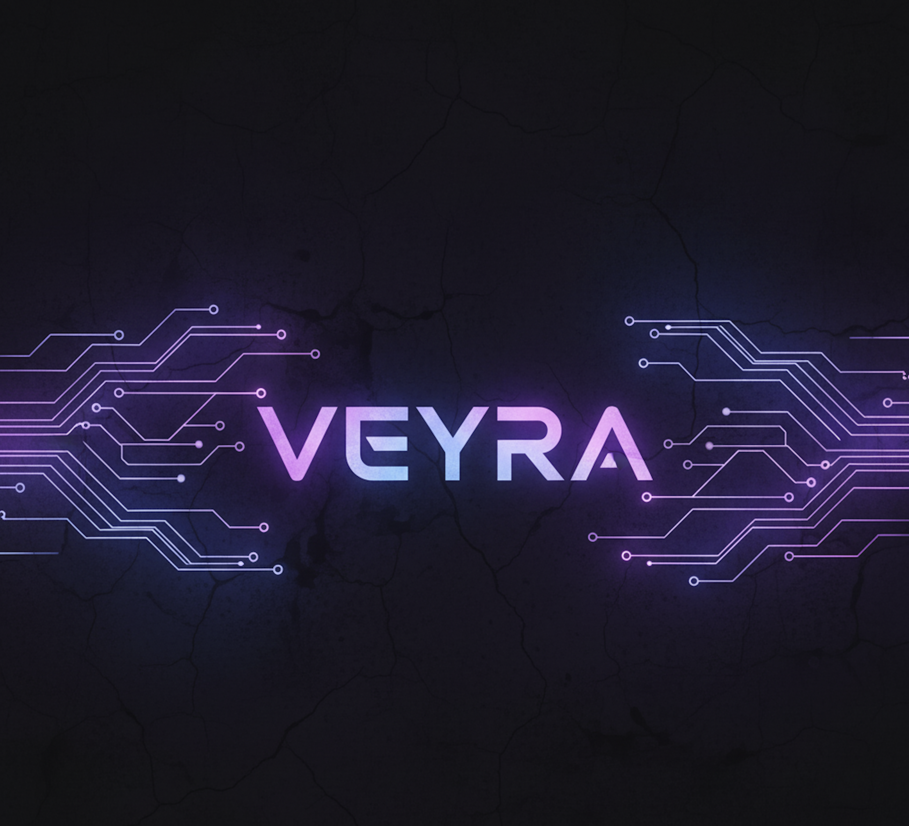

# Veyra Discord RPG Bot — Comprehensive Documentation




> **A comprehensive Discord RPG bot featuring economy, combat, crafting, and social systems — all designed to simulate a living world inside your server.**

---

## Table of Contents

1. [Overview](#overview)
2. [Getting Started](#getting-started)
3. [Core Systems](#core-systems)
   - [Registration & Onboarding](#registration--onboarding)
   - [Economy System](#economy-system)
   - [Inventory System](#inventory-system)
   - [Shop & Marketplace](#shop--marketplace)
   - [Combat System](#combat-system)
   - [Jobs System](#jobs-system)
   - [Crafting & Upgrades](#crafting--upgrades)
   - [Alchemy System](#alchemy-system)
   - [Lootbox System](#lootbox-system)
   - [Quest System](#quest-system)
   - [Experience & Leveling](#experience--leveling)
   - [Friendship System](#friendship-system)
   - [Mini-Games](#mini-games)
   - [Gambling & Racing](#gambling--racing)
   - [Casino System](#casino-system)
  - [Lottery System](#lottery-system)
4. [Items & Rarities](#items--rarities)
5. [Weapons & Spells](#weapons--spells)
6. [Command Reference](#command-reference)
7. [API Reference](#api-reference)
8. [Developer Reference](#developer-reference)
9. [System Interactions](#system-interactions)
10. [Gameplay Loops](#gameplay-loops)

---

## Overview

**Veyra** is a modular, AI-integrated Discord bot that combines utility, RPG systems, social simulation, and procedural dialogue. The bot is built using:

- **Language:** Python 3.11
- **Framework:** Pycord (py-cord 2.6.1)
- **ORM:** SQLAlchemy 2.0
- **Database:** PostgreSQL
- **Scheduler:** APScheduler (for background jobs)

### Key Features

| Feature | Description |
|---------|-------------|
| **Economy** | Gold-based currency with wallets, transfers, and dynamic pricing |
| **Combat** | Turn-based 1v1 PvP and PvE campaign battles with weapons/spells |
| **Marketplace** | Player-driven trading with escrow and fee systems |
| **Jobs** | Energy-based work system with rewards (knight, digger, miner, thief, explorer) |
| **Crafting** | Ore smelting with upgradable buildings |
| **Lootboxes** | Tiered reward boxes with rarity-based drops |
| **Quests** | Time-limited objective quests (battle, jobs, casino, market, crafting) |
| **Mini-Games** | Wordle solver, number guessing, coin flip, animal racing |
| **Casino** | Chip-based gambling with slots, roulette, coin flip, and dungeon raid |
| **Lottery** | Daily ticket lottery with weekday/weekend ticket counts |
| **Friendship** | Relationship leveling with Veyra through interactions |
| **AI Chat** | GPT-based conversational AI (WIP) |

---

## Getting Started

### Installation

```bash
git clone https://github.com/Sylver-Icy/Veyra.git
cd Veyra
pip install -r requirements.txt
```

### Configuration

1. Create a `veyra.env` file with the following:
   ```env
   DISCORD_TOKEN=your_discord_bot_token
   # PostgreSQL connection details
   DATABASE_URL=your_postgresql_connection_string
   ```

2. Set up your PostgreSQL database and run the schema migrations.

3. Start the bot:
   ```bash
   python veyra.py
   ```

### First Steps for Players

1. Use `!helloVeyra` to register and become friends with Veyra
2. Complete the interactive tutorial (guided step-by-step)
3. Use `/help` or `/commandhelp <command>` for assistance

---

## Core Systems

### Registration & Onboarding

#### How It Works

Players must register before using most commands. Registration is handled through the `!helloVeyra` command.

**Registration Process:**
1. Player uses `!helloVeyra`
2. Veyra asks "Wanna be frnds with me? (Yes/No)"
3. If "Yes": Player is registered with:
   - A new user record in the database
   - An empty wallet
   - 2× Bag of Gold (item ID 183) as a starter gift
   - 150 starting energy
4. A guided tutorial begins

**Tutorial Flow:**
The tutorial system (`tutorial_services.py`) guides new players through:

| State | Task | Description |
|-------|------|-------------|
| NOT_STARTED | - | Initial state |
| CHECK_WALLET | `/check wallet` | Learn to check your gold |
| PLAY | `!play` | Play the number guessing game |
| OPEN_SHOP | `/shop` | View the shop system |
| WORK | `/work <job>` | Perform your first job |
| COMPLETED | - | Tutorial finished |

The tutorial currently uses a mixed command set:
- Registration, `!play`, and `!use` are still prefix commands
- Wallet, shop, and work steps use slash commands

**Technical Details:**
- User state stored in `users.tutorial_state` column
- Tutorial guards block commands until the current step is completed
- Tutorial can be bypassed by setting `tutorial_state = -1`

---

### Economy System

The economy is gold-based with multiple sources and sinks to maintain balance.

#### Gold Sources
- **Jobs:** Knight (40-90g), Digger (20g + lootboxes), Miner (25g + ores), Thief (10% steal)
- **Quests:** Delivery rewards (10-1200g based on rarity/streak)
- **Lootboxes:** Gold drops (3-500g based on tier)
- **Marketplace sales:** Sell items to other players
- **Shop buyback:** Sell items to the daily shop
- **Battle victories:** Winner takes 90% of total pot
- **Racing winnings:** Proportional payout from prize pool
- **Usable items:** Bag of Gold grants 100g
- **Campaign rewards:** Gold rewards for clearing stages

#### Gold Sinks
- **Shop purchases:** Buy items from daily shop
- **Marketplace purchases:** Buy from player listings
- **Battle bets:** Entry stakes for PvP
- **Racing bets:** Wagers on animal races
- **Transfer fees:** 5% fee on gold transfers
- **Marketplace fees:** 7% seller fee on sales
- **Building purchases:** Unlock/upgrade crafting buildings
- **Smelting costs:** Coal consumed during crafting

#### Key Functions

| Function | Description |
|----------|-------------|
| `add_gold(user_id, amount)` | Add gold to user's wallet |
| `remove_gold(user_id, amount)` | Remove gold (raises error if insufficient) |
| `check_wallet(user_id)` | Returns current gold balance |
| `get_richest_users(limit)` | Returns top N users by gold |

#### Leaderboard

A `/leaderboard` command shows the top 10 richest users. Weekly leaderboards are posted automatically every Sunday at midnight UTC.

#### Loan System

Players can take loans to get quick gold, with repayment required within a set term.

**Starter Loan:**
- One-time loan available to all players
- Amount: 2,000 gold
- Repayment: 2,000 gold (no interest)
- Term: 7 days
- Use `/loan` to take, `!repayloan` to repay

**Failure to Repay:**
- Hurts your credit score
- Locks you out of future loans
- DM reminders sent 2 days before due date

*Note: Additional loan types exist (Squire's Advance, Baron's Favor, etc.) with varying principal amounts, interest rates, and credit score requirements.*

---

### Inventory System

Players can collect, trade, and use items stored in their inventory.

#### Item Properties

Each item in the database (`items` table) has:

| Property | Description |
|----------|-------------|
| `item_id` | Unique identifier |
| `item_name` | Display name |
| `item_description` | Flavor text |
| `item_rarity` | Common, Rare, Epic, Legendary, Paragon |
| `item_icon` | Emoji or image reference |
| `item_price` | Base value |
| `item_usable` | Whether the item can be consumed |
| `item_durability` | *Optional* durability stat (currently unused) |

#### Inventory Commands

| Command | Description |
|---------|-------------|
| `/check inventory` | View your items (paginated) |
| `!info <item>` | Get detailed info about any item |
| `!use <item>` | Use a consumable item |
| `/transfer_item` | Give items to another player |
| `/find_item <item>` | Discover currently available item sources (shop/marketplace/players) |

#### Usable Items

Defined in `utils/usable_items.py`:

| Item | Effect |
|------|--------|
| Potion of EXP | +500 EXP |
| Jar of EXP | +2000 EXP |
| Bag of Gold | +100 Gold |
| Bread | +100 Energy |
| Hint Key | Activates hint in number guessing game |
| Potion Of Faster Recovery I | Applies energy regeneration effect (+2 energy per regen tick for 18 hours) |
| Potion Of Faster Recovery II | Applies energy regeneration effect (+5 energy per regen tick for 10 hours) |
| Potion Of Faster Recovery III | +150-200 Energy instantly |
| Potion Of Luck I | Applies luck effect (enhanced thief job: 90% success rate, 500g max steal for 24 hours) |
| Potion Of Luck II | Applies luck effect (reduces casino losses by 10% for 24 hours) |
| Potion Of Luck III | 80% chance to upgrade Iron Box → Platinum Box, 20% to downgrade to Stone Box |
| Potion Of Love I | Cannot be used; gift to others to express love |
| Potion Of Hatred I | Cannot be used; gift to others to express hate | |

#### Item Name Resolution

The system uses fuzzy matching (`rapidfuzz`) to suggest corrections for misspelled item names. Item name-to-ID mapping is cached in `utils/itemname_to_id.py`.

---

### Shop & Marketplace

Veyra features two distinct trading systems:  a bot-run **Shop** and a player-driven **Marketplace**.

#### Daily Shop

The shop rotates daily at midnight UTC with:
- **Sell Section:** 6 random items (Common/Rare/Epic) that players can buy
- **Buyback Section:** 5 items (Common/Rare/Epic/Legendary) that players can sell
  - The 5th item has a 1. 3-2. 2x bonus multiplier on its price

**Shop Pricing:**

| Rarity | Buy Price Range | Buyback Range |
|--------|-----------------|---------------|
| Common | 5-10g | 5-10g |
| Rare | 15-22g | 15-22g |
| Epic | 50-70g | 50-70g |
| Legendary | 200-280g | 200-280g |
| Paragon | 600-900g | 600-900g |

**Shop Commands:**

| Command | Description |
|---------|-------------|
| `/shop` | View today's shop (shows both sections) |
| `!buy <item> <qty>` | Purchase items from the sell section |
| `!sell <item> <qty>` | Sell items to the buyback section |

#### Player Marketplace

The marketplace allows players to create listings for other players to buy.

**How It Works:**
1. **Creating a listing:** Items are taken from your inventory and held in escrow
2. **Buying:** Buyer pays gold → seller receives 93% (7% fee) → buyer gets items
3. **Deleting:** Items are refunded to the seller's inventory

**Marketplace Commands:**

| Command | Description |
|---------|-------------|
| `/create_listing` | List items for sale (max 4 active listings) |
| `/loadmarketplace` | Browse all active listings |
| `/buy_from_marketplace <id> <qty>` | Purchase from a listing |
| `/delete_listing <id>` | Remove your listing and refund items |

---

### Combat System

Veyra features a sophisticated turn-based combat system with PvP (1v1 battles) and PvE (campaign mode).

#### Battle Mechanics

**Core Stats:**

| Stat | Base Value | Description |
|------|------------|-------------|
| HP | 40 + weapon bonus | Health points; 0 = defeat |
| Attack | 5 + weapon bonus | Damage output |
| Defense | 10 + weapon bonus | Damage reduction percentage |
| Speed | 10 + weapon bonus | Turn order; affects block/counter success |
| Mana | 10 + weapon bonus | Required for casting spells |
| Frost | 0 | Accumulates; at 10, triggers 50% HP damage |

**Stances (Actions):**

Each round, players choose one of five stances:

| Stance | Description |
|--------|-------------|
| **Attack** | Deal damage based on Attack stat.|
| **Block** | Reduce incoming damage by 70%. Gain defense on success.  Fails if too slow.  |
| **Counter** | Reflect 50% of damage if opponent attacks. Penalties if wrong guess. |
| **Recover** | Regenerate HP or Mana (alternates). Only works if opponent is defensive. |
| **Cast** | Use your equipped spell (costs Mana). |

**Stance Interactions Matrix:**

| P1 \ P2 | Attack | Block | Counter | Recover | Cast |
|---------|--------|-------|---------|---------|------|
| Attack | Both deal damage (faster goes first) | P1 blocked | P1 countered | P2 interrupted, takes damage | P2 casts if faster |
| Block | P1 blocks P2 | Both lose 7 HP | P1: -2 HP, P2: -4 speed | P2 recovers, P1 loses defense | P2 casts |
| Counter | P2 countered | P1: -4 speed, P2: -2 HP | Both lose 10 defense | P2 recovers, P1 penalized | P2 casts |
| Recover | P1 interrupted | P1 recovers, P2 loses defense | P1 recovers, P2 penalized | Both fail | P2 casts |
| Cast | P1 casts | P1 casts | P1 casts | P1 casts | Faster caster wins; other loses 5 mana |

**Status Effects:**

| Effect | Duration | Per-Round Effect |
|--------|----------|------------------|
| Nightfall | 5 rounds | Random stat reduced (attack: -1, speed: -1, mana: -2, hp: -3, defense: -5) |
| Large Heal | 4 rounds | Heal 4 HP per round |
| Frostbite | Accumulates | At 10 stacks: 50% current HP damage |
| Veil of Darkness | 4 rounds | Incoming attack damage reduced by 60% |

**Timeout Penalty:**
- If a player doesn't choose within 50 seconds:  -25 HP penalty
- Default action becomes "Attack"

#### PvP Battles

**Starting a Battle:**
```
/battle @opponent <bet_amount>
```

1.  Challenger's bet is deducted immediately
2. Target receives a challenge embed with Accept/Decline buttons
3. If accepted, target's bet is also deducted
4. Battle begins with alternating rounds
5. Winner receives 90% of total pot (10% Veyra fee)

**Loadout System:**
Players can customize their weapon and spell:
```
/loadout
```

#### PvE Campaign

Campaign Mode is a solo progression system where players fight against AI opponents across 15 stages of increasing difficulty. Stages 1-10 feature Veyra as the opponent, while stages 11-15 introduce Bardok, a new challenging enemy. Each stage requires defeating the opponent to advance, with unique rewards granted upon completion.

**Starting a Campaign Battle:**
```
/campaign
```

**How Campaign Mode Works:**
- Players fight using their own loadout (weapon + spell)
- The opponent's loadout and stats are determined by your current campaign stage
- Combat uses the same turn-based mechanics as PvP battles
- Veyra (stages 1-10) and Bardok (stages 11-15) are controlled by AI that adapts strategy based on equipped weapons and your play patterns
- Defeat the opponent to advance to the next stage and claim rewards
- You cannot start a new campaign battle while already in an active battle

**Campaign Stages 1-10 (Veyra):**

| Stage | Veyra's Weapon | Veyra's Spell | Bonus HP | Bonus Mana |
|-------|----------------|---------------|----------|------------|
| 1 | Training Blade | Fireball | -25 | -5 |
| 2 | Moon Slasher | Frostbite | -10 | -2 |
| 3 | Training Blade | Erdtree Blessing | 0 | 0 |
| 4 | Moon Slasher | Frostbite | +5 | 0 |
| 5 | Elephant Hammer | Erdtree Blessing | +5 | 0 |
| 6 | Eternal Tome | Nightfall | +10 | +5 |
| 7 | Training Blade | Heavyshot | +15 | +5 |
| 8 | Dark Blade | Fireball | +15 | 0 |
| 9 | Moon Slasher | Frostbite | +22 | +8 |
| 10 | Veyra's Grimoire | Veil of Darkness | +25 | +10 |

**Campaign Stages 11-15 (Bardok):**

| Stage | Bardok's Weapon | Bardok's Spell | Bonus HP | Bonus Mana | Special Mechanic |
|-------|-----------------|----------------|----------|------------|------------------|
| 11 | Bardok's Claymore | Nightfall | +10 | +5 | - |
| 12 | Bardok's Claymore | Earthquake | +15 | +15 | - |
| 13 | Bardok's Claymore | Earthquake | +5 | +5 | Gains attack if you repeat the same stance |
| 14 | Bardok's Claymore | Earthquake | +5 | +10 | Lava Arena: periodic fire damage |
| 15 | Moon Slasher | Fireball | +10 | +15 | Frozen Arena: ice effects |

**Campaign Rewards:**

| Stage | Reward |
|-------|--------|
| 1 | 40 Gold |
| 2 | 1× Wooden Box |
| 3 | 100 Gold |
| 4 | 250 Gold |
| 5 | 2× Stone Box |
| 6 | 4× Bag of Gold |
| 7 | 5× Hint Key |
| 8 | 2× Iron Box |
| 9 | 1× Platinum Box |
| 10 | **Unlocks Veyra's Grimoire & Veil of Darkness** |
| 11 | 1× Potion of Energy Regen II |
| 12 | 5× Flasks |
| 13 | 3× Hint Key |
| 14 | 2× Potion of Luck III |
| 15 | **Unlocks Bardok's Claymore & Earthquake**, 1× Potion of Hatred |

**Campaign Completion:**
- Upon completing Stage 10, you unlock access to Veyra's signature weapon and spell for use in PvP battles
- Upon completing Stage 15, you unlock Bardok's Claymore weapon and Earthquake spell
- Once Stage 15 is completed, attempting `/campaign` will display a completion message
- Campaign progress is saved per-user in the database

**Tips for Campaign:**
- Early stages are easier with weaker opponent stats (negative bonuses)
- Stage difficulty ramps up with opponents gaining HP/Mana bonuses
- Study opponent weapon effects to anticipate their strategy (e.g., Moon Slasher builds Frost)
- Bardok stages (11-15) introduce new mechanics like arena effects and stance penalties

---

### Jobs System

Jobs are energy-based activities that generate resources.

#### Energy System

- **Maximum Energy:** 35 + (15 × level)
- **Regeneration:** +1 energy every 6 minutes (via scheduled job)
- **Level-up bonus:** +15 energy on level up

#### Available Jobs

| Job | Energy Cost | Rewards | Notes |
|-----|-------------|---------|-------|
| **Knight** | 55 | 40-90 gold | Reliable gold income |
| **Digger** | 70 | Lootboxes or 20 gold | See drop rates below |
| **Miner** | 70 | Ores or 25 gold | See drop rates below |
| **Thief** | 69 | Steal 5-10% of target's gold (max 300g) | 50% success rate; -30g fine on fail; target loses 1% of wealth; 6h robbery shield |
| **Explorer** | 20 | Random Common/Rare item | 85% Rare, 15% Common |

**Digger Drop Rates:**
- Gold: 27%
- Wooden Box: 35%
- Stone Box: 25%
- Iron Box: 10%
- Platinum Box: 3%

**Miner Drop Rates:**
- Gold: 10%
- Coal: 27%
- Copper Ore: 30%
- Iron Ore: 21%
- Silver Ore: 12%

**Miner Ore Quantities:**
- Normal (97% chance): 3-6 ores
- Bonus (3% chance): 12-20 ores

**Commands:**
```
/work knight
/work digger
/work miner
/work explorer
/work thief @target
/check energy
```

---

### Crafting & Upgrades

#### Smelting

Convert raw ores into bars using the `/smelt` command.

**Smelting Recipes:**

| Bar | Required Ore | Ore Amount |
|-----|--------------|------------|
| Copper Bar | Copper Ore | 5 per bar |
| Iron Bar | Iron Ore | 5 per bar |
| Silver Bar | Silver Ore | 5 per bar |

**Coal Cost by Smelter Level:**

| Level | Allowed Bars | Coal per Bar |
|-------|--------------|--------------|
| 1 | Copper only | 5 |
| 2 | Copper, Iron | 4 |
| 3 | Copper, Iron | 4 |
| 4 | Copper, Iron | 3 |
| 5 | Copper, Iron, Silver | 3 |
| 6 | Copper, Iron, Silver | 2 |
| 7 | Copper, Iron, Silver | 1 |

**Bar Sell Prices:**
- Copper Bar:  50g
- Iron Bar:  150g
- Silver Bar: 450g

#### Building System

Players can unlock and upgrade buildings (currently:  Smelter, Inventory, Pockets, Brewing Stand).

**Commands:**
```
!unlock <building>    # Purchase a building (level 1)
!upgrade <building>   # Upgrade to next level (requires gold)
```

**Technical Details:**
- Building definitions stored in `upgrade_definitions` table
- User upgrades stored in `user_upgrades` table
- Each level has defined cost and effect description

---

### Alchemy System

The alchemy system allows players to craft potions with various effects using a Brewing Stand.

#### Requirements

- Players must own a **Brewing Stand** building (`!unlock brewing stand`)
- Brewing Stand level determines which potion tiers can be crafted:
  - Level 1: Tier 1 potions
  - Level 2: Tier 1-2 potions
  - Level 3: Tier 1-3 potions

#### Available Potions

| Potion | Tier | Effect | Duration | Strain | Key Ingredients |
|--------|------|--------|----------|--------|-----------------|
| Potion Of Faster Recovery I | 1 | +2 energy per regen tick | 18 hours | 35 | Flask, Coal, Copper Ore, Deer Horn |
| Potion Of Faster Recovery II | 2 | +5 energy per regen tick | 10 hours | 52 | Flask, Coal, Copper Ore, Iron Ore, Mana Berries |
| Potion Of Faster Recovery III | 3 | +150-200 energy instantly | Instant | 75 | Flask, Coal, Iron Bar, Silver Ore, Dragon Egg |
| Potion Of Luck I | 1 | Enhanced thief job success (90% rate, 500g max) | 24 hours | 32 | Flask, Rabbit Foot, Scraps |
| Potion Of Luck II | 2 | Reduces casino losses by 10% | 24 hours | 62 | Flask, Rabbit Foot, Slime in jar, Apples |
| Potion Of Luck III | 3 | 80% chance to upgrade Iron Box → Platinum Box (20% to Stone Box) | Instant | 70 | Flask, Rabbit Foot, Shiny Rugs, Ancient Cheese, Abyssal Feather |
| Potion Of Love I | 1 | Gift item (cannot be used by self) | 1 hour | 12 | Flask, Apples, Rare Candy, Lanter |
| Potion Of Hatred I | 2 | Gift item (cannot be used by self) | - | 42 | Flask, Coal, Iron Ore, Silver Ore |

#### Strain System

Using potions accumulates **strain** on your body:
- Each potion adds strain when consumed
- Strain value (0-100) equals % chance next potion use fails
- If a potion fails, it is wasted and has no effect
- Strain decays by 1 point every 25 minutes (scheduled decay)

**Strain Status Messages:**
- 0: "Your body feels normal. No lingering side effects remain."
- 1-10: "You feel mostly fine. A slight dizziness lingers, but another potion should be safe."
- 11-30: "Your head feels light and your body is warm. Drinking more might start to feel uncomfortable."
- 31-60: "Your stomach churns and your vision blurs slightly. Another potion could make things worse."
- 61-89: "You feel nauseous, weak, and unsteady. Drinking another potion is risky."
- 90+: "You are extremely sick. Your body is rejecting the toxins. Drinking another potion could make you faint."

**Commands:**
```
/brew <potion_name_or_id>   # Craft a potion
!use <potion_name>          # Use a potion
```

---

### Lootbox System

Lootboxes contain gold and random items based on rarity tiers.

#### Lootbox Types

| Box | Gold Range | Rolls | Drop Rates |
|-----|------------|-------|------------|
| **Wooden** | 12-32g | 1-2 (85%/15%) | Common: 88%, Rare: 10%, Epic: 2% |
| **Stone** | 60-122g | 1-2 (60%/40%) | Common: 67%, Rare: 28%, Epic: 5% |
| **Iron** | 200-310g | 1-3 (13%/70%/17%) | Common: 48%, Rare: 37%, Epic: 15% |
| **Platinum** | 400-800g | 3-6 (33%/38%/20%/9%) | Common: 21%, Rare: 50%, Epic: 25%, Legendary: 4% |

#### Item Quantities per Box/Rarity

| Box | Common | Rare | Epic | Legendary |
|-----|--------|------|------|-----------|
| Wooden | 1-2 | 1 | 1 | - |
| Stone | 1-3 | 1-2 | 1 | - |
| Iron | 2-5 | 1-3 | 1-2 | - |
| Platinum | 4-7 | 3-6 | 1-3 | 1 |

**Command:**
```
!open <box_name>
```

---

### Quest System

The quest system provides rotating, time-limited objective quests.

#### How Quests Work

1. Use `/quest` to view your current quest
2. Complete objective-based progress requirements before expiry
3. Claim rewards when complete (gold, EXP, and/or items depending on quest)
4. If your active quest expires, use the quest message action to generate a new one

**Quest Structure:**
- Every quest has a `type`, `target`, `duration_hours`, and reward bundle
- Progress is automatically updated by gameplay events (jobs, battles, lootbox opens, casino plays, market activity, smelting, brewing, etc.)
- Expired or claimed quests roll into new quests via the `/quest` flow

**Current Quest Types (examples):**

| Quest Type | Example Objective |
|------------|-------------------|
| `BATTLE_WIN` | Win a set number of battles |
| `BATTLE_WIN_STREAK` | Win consecutive battles without losses |
| `JOB_COMPLETE` | Complete jobs (knight/digger/miner/explorer/thief) |
| `LOOTBOX_OPEN` | Open lootboxes of any tier |
| `CASINO_PLAY` | Play casino games a target number of times |
| `GOLD_EARN` | Earn total gold from any source |
| `GOLD_SPEND` | Spend total gold on systems like shop/market/upgrades |
| `ITEM_SELL` | Sell listings/items in marketplace flow |
| `ITEM_BUY` | Buy items from marketplace |
| `SMELT` | Smelt bars from ores |
| `BREW_POTION` | Craft potions at brewing stand |

**Reward Format:**
- Quests can grant any combination of:
  - Gold
  - EXP
  - Items (e.g., Wooden/Stone/Iron/Platinum boxes, Coal)

**Command:**
```
/quest
```

---

### Experience & Leveling

Players gain EXP through various activities and level up to unlock benefits.

#### EXP Sources

| Activity | EXP Gained |
|----------|------------|
| Chatting | 1-2 (30-second cooldown) |
| Successful command completion | 1-20 (10-second anti-farm cooldown) |
| Potion of EXP | 500 |
| Jar of EXP | 2000 |

#### Level Thresholds

| Level | Total EXP Required |
|-------|-------------------|
| 1 | 0 |
| 2 | 100 |
| 3 | 250 |
| 4 | 400 |
| 5 | 600 |
| 6 | 900 |
| 7 | 1,250 |
| 8 | 1,600 |
| 9 | 2,200 |
| 10 | 3,000 |
| 11 | 4,200 |
| 12 | 5,500 |
| 13 | 7,000 |
| 14 | 9,000 |
| 15 | 12,000 |
| 16 | 15,000 |
| 17 | 18,000 |
| 18 | 22,000 |
| 19 | 27,000 |
| 20 | 32,000 |
| 21 | 38,000 |
| 22 | 48,000 |
| 23 | 60,000 |
| 24 | 78,000 |
| 25 | 100,000 |

#### Level-Up Benefits

- **Energy:** +15 max energy per level
- **Quests:** Higher-level players get access to rarer quest items

**Commands:**
```
/check exp
```

---

### Friendship System

Players build friendship with Veyra through interactions.

#### Earning Friendship EXP

| Action | Friendship EXP |
|--------|----------------|
| Complete any command | +1 |
| Transfer gold to Veyra | 1 per 10 gold (+ bonus 1) |
| Give items to Veyra | +9 per item |

**Daily Cap:** 50 friendship EXP per day (resets at midnight UTC)

#### Friendship Tiers

| EXP Required | Title |
|--------------|-------|
| 0 | Stranger |
| 100 | Acquaintance |
| 300 | Casual |
| 700 | Friend |
| 1,200 | Close Friend |
| 1,800 | Bestie |
| 2,500 | Veyra's favourite 💖 |

**Command:**
```
!helloVeyra   # Shows current friendship status
```

#### Referral / Invite System

Players can track invite progress through `/invite`. Invite rewards are tied to **successful invites** (an invited player reaching level 5).

**Milestones:**

| Successful Invites | Reward |
|--------------------|--------|
| 1 | 1× Iron Box |
| 3 | 300 Chips |
| 7 | 1× Platinum Box |
| 11 | Role: Veyra Early Supporter |

**Command:**
```
/invite
```

---

### Mini-Games

#### Number Guessing Game

**Command:** `!play`

**How It Works:**
1. Game available every 12 hours (cooldown-based)
2. Progress through 4 stages with increasing difficulty
3. Guess the correct number within a range
4. Wrong guess = game over (or use Hint Key)

**Stage Difficulty:**

| Stage | Range Size | Example Range |
|-------|------------|---------------|
| 1 | 2 numbers | 50-51 |
| 2 | 4 numbers | 50-53 |
| 3 | 10 numbers | 50-59 |
| 4 | 15 numbers | 50-64 |

**Rewards by Exit Stage:**

| Exit Stage | Reward |
|------------|--------|
| 1 | 1× Wooden Box |
| 2 | 1× Stone Box |
| 3 | 3× Stone Box |
| 4 | 1× Iron Box + 1× Wooden Box |
| Win (all 4) | 1× Platinum Box + 1× Stone Box |

**Hint Key:**
- Use `!use Hint Key` during the game
- Next wrong guess reveals if answer is higher/lower instead of ending game
- Only works for one guess

#### Wordle Solver

**Commands:**
- `!solve_wordle` - Interactive Wordle solving in a thread
- `/wordle_hint` - Get a hint based on previous guesses

**Input Format:**
- Enter pattern after each guess:  `0` = gray, `1` = yellow, `2` = green
- Example: If "CRANE" returns C=🟩, R=⬜, A=🟨, N=⬜, E=🟩 → input `20102`

#### Coin Flip

**Command:** `!flipcoin`

Simple random head/tail result with a procedurally generated response.

---

### Gambling & Racing

#### Animal Race

A betting game where 3 animals race to the finish line.

**Starting a Race:**
```
/start_race
```

**Betting:**
```
!bet <animal> <amount>
```
- Animals:  `rabbit`, `turtle`, `fox`
- Betting phase: 3 minutes
- One bet per user per race
- Gold deducted immediately

**Race Mechanics:**
- Finish line:  30 tiles
- Movement: Random 1-4 tiles per tick
- Updates every 4 seconds with embed refresh
- Hype messages generated based on standings

**Reward Distribution:**
- 10% system fee deducted from total pot
- Winners split remaining 90% proportionally based on bet size
- Formula: `payout = (your_bet / total_winning_bets) × (pool × 0.9)`

**Cooldown:** 15 minutes between races per guild

---

### Casino System

The casino provides chip-based gambling games with various risk/reward profiles.

#### Chips Currency

Chips are a separate currency used exclusively in the casino:
- **Buy chips** with gold via `/casino` → chip packs
- **Cash out** chips back to gold via `/casino` → cashout options
- Daily rotation of available chip packs and cashout options

#### Chip Packs (Examples)

| Pack | Gold Cost | Chips | Bonus |
|------|-----------|-------|-------|
| Starter Stack | 1,000g | 100 | 0 |
| Copper Kick | 3,200g | 320 | +80 |
| Bronze Bundle | 7,444g | 744 | +200 |
| Silver Surge | 10,667g | 1,067 | +320 |
| Goblin Investment | 13,889g | 1,389 | +380 |
| Merchant Madness | 17,111g | 1,711 | +400 |
| Noble Boost | 20,333g | 2,033 | +470 |
| Duke's Deal | 23,556g | 2,356 | +580 |
| Imperial Blast | 26,778g | 2,678 | +820 |
| Dragon Jackpot | 30,000g | 3,000 | +1,285 |

*Note: Only 5 of the 10 packs are available each day. The selection rotates daily at midnight UTC.*

#### Cashout Options (Examples)

| Option | Chips Cost | Gold | Bonus Gold |
|--------|------------|------|------------|
| Quick Cash | 100 | 500g | 0 |
| Snack Refund | 250 | 1,250g | +150 |
| Halfback | 500 | 2,500g | +450 |
| Full Refund | 1,000 | 5,000g | +1,000 |
| Trader Payout | 1,500 | 7,500g | +1,800 |
| Guild Payday | 2,500 | 12,500g | +3,600 |
| Noble Cashout | 4,000 | 20,000g | +6,400 |
| Royal Withdrawal | 6,000 | 30,000g | +10,200 |
| Imperial Cashout | 8,000 | 40,000g | +13,600 |
| Dragon Payday | 10,000 | 50,000g | +18,000 |

*Note: Only 5 of the 10 cashout options are available each day. The selection rotates daily at midnight UTC.*

#### Casino Games

| Game | Min Bet | Max Bet | Description |
|------|---------|---------|-------------|
| **Flip Coin** | 1 | 5,000 | 50/50 heads or tails (2x payout) |
| **Roulette** | 10 | 2,500 | Pick 0-9, win 10x if correct |
| **Slots** | 10 | 2,000 | Triple match wins up to 25x |
| **Dungeon Raid** | 10 | 3,000 | Risk-based area exploration |

**Dungeon Areas:**

| Area | Death Chance | Multiplier |
|------|--------------|------------|
| Safe Caves | 20% | 1.20x |
| Goblin Tunnels | 35% | 1.50x |
| Ancient Ruins | 50% | 2.00x |
| Dragon Lair | 70% | 3.33x |
| Abyss Gate | 85% | 6.66x |

**Commands:**
```
/casino                           # View chip packs and cashout options
!buychips <pack_id>               # Buy a chip pack
!cashout <pack_id>                # Cash out chips for gold
/gamble <mode> ...                # Play casino games via slash subgroup
```

---

### Lottery System

Veyra runs a scheduled lottery announcement + result cycle via background jobs.

#### Ticket Availability

- **Weekdays (Mon-Fri):** 10 tickets posted at midnight UTC
- **Weekends (Sat-Sun):** 50 tickets posted at midnight UTC
- **Results:** Drawn daily at midnight UTC

#### Notes

- Lottery posts are scheduler-driven (`send_lottery`, `send_result`)
- Ticket and winner stats are tracked in `lottery_entries` and `user_stats.biggest_lottery_win`
- Lottery interaction is currently embed-driven from scheduled posts (no standalone slash command in cogs)

---

## Items & Rarities

### Rarity Tiers

| Rarity | Description |
|--------|-------------|
| **Common** | Frequently obtained; low value |
| **Rare** | Less common; moderate value |
| **Epic** | Scarce; high value |
| **Legendary** | Very rare; very high value |
| **Paragon** | Extremely rare; highest value |

### Special Item Categories

#### Lootboxes (IDs 176-179)
- Wooden Box (176)
- Stone Box (177)
- Iron Box (178)
- Platinum Box (179)

#### Ores (IDs 184-187)
- Copper Ore (184)
- Iron Ore (185)
- Silver Ore (186)
- Coal (187)

#### Bars (IDs 189-191)
- Copper Bar (189)
- Iron Bar (190)
- Silver Bar (191)

#### Consumables
- Bag of Gold (183) - +100 gold
- Bread - +100 energy
- Potion of EXP - +500 EXP
- Jar of EXP - +2000 EXP
- Hint Key (180) - Use during guessing game

---

## Weapons & Spells

### Available Weapons

| Weapon | Attack | HP | Defense | Speed | Mana | Special Effect |
|--------|--------|-----|---------|-------|------|----------------|
| **Training Blade** | +5 | - | - | - | - | +1 Attack on each hit |
| **Moon Slasher** | +2 | +5 | +8 | +3 | +1 | +4 Frost on hit |
| **Dark Blade** | +8 | - | - | - | - | Disables healing for both players |
| **Elephant Hammer** | +3 | +10 | +15 | -1 | - | Full block (no damage taken) |
| **Eternal Tome** | +3 | - | - | - | +5 | +3 duration to all status effects |
| **Veyra's Grimoire** ⭐ | +2 | - | - | - | +2 | On spell cast:  +4 Mana, -5 HP |
| **Bardok's Claymore** ⭐⭐ | +10 | - | -10 | -2 | - | Heals Bardok 4 HP on hit (player effect dormant) |

⭐ *Campaign-exclusive:  Unlocked by completing Stage 10*
⭐⭐ *Campaign-exclusive: Unlocked by completing Stage 15*

### Available Spells

| Spell | Mana Cost | Effect |
|-------|-----------|--------|
| **Fireball** | 15 | Deal 16 damage |
| **Nightfall** | 9 | Apply Nightfall status (5 rounds) |
| **Heavyshot** | 16 | Set opponent's HP equal to your HP |
| **Erdtree Blessing** | 14 | Apply Large Heal status to self (4 rounds) |
| **Frostbite** | 6 | +5 Frost to target, -1 Speed |
| **Veil of Darkness** ⭐ | 10 | Apply Veil of Darkness status (4 rounds): reduces incoming attack damage by 60% |
| **Earthquake** ⭐⭐ | 13 | Deal 5 damage, shatter defense (set to 0), -3 Speed |

⭐ *Campaign-exclusive: Unlocked by completing Stage 10*
⭐⭐ *Campaign-exclusive: Unlocked by completing Stage 15*

### Default Loadout

New players start with:
- Weapon: Training Blade
- Spell:  Nightfall

---

## Command Reference

### Prefix Commands (`!`)

| Command | Description | Cooldown |
|---------|-------------|----------|
| `!helloVeyra` | Register or check friendship | 15s |
| `!info <item>` | Get item details | 5s |
| `!use <item>` | Use consumable item | - |
| `!buy <item> <qty>` | Buy from shop | 5s |
| `!sell <item> <qty>` | Sell to buyback | 5s |
| `!open <box>` | Open a lootbox | 5s |
| `!unlock <building>` | Purchase a building | 20s |
| `!upgrade <building>` | Upgrade a building | 20s |
| `!bet <animal> <amount>` | Bet on race | - |
| `!ping` | Ping-pong | - |
| `!flipcoin` | Flip a coin | - |
| `!play` | Number guessing game | - |
| `!solve_wordle` | Interactive Wordle solver | - |
| `!buychips <pack_id>` | Buy casino chip pack | - |
| `!cashout <pack_id>` | Cash out chips for gold | - |
| `!repayloan` | Repay active loan | - |

### Slash Commands (`/`)

| Command | Description | Cooldown |
|---------|-------------|----------|
| `/help` | View all commands | 25s |
| `/commandhelp <command>` | Show detailed help for one command | 5s |
| `/details <topic>` | Show system details from docs topics | - |
| `/shop` | View daily shop | 15s |
| `/casino` | View casino chip packs and cashout options | 155s |
| `/quest` | View current rotating objective quest | - |
| `/battle @user <bet>` | Challenge to PvP | - |
| `/campaign [delay]` | Fight AI in campaign mode (PvE) | - |
| `/open_to_battle <min_bet> <max_bet>` | Join auto-match PvP queue | - |
| `/loadout` | Open UI to manage weapon/spell loadout | - |
| `/transfer_gold @user <amount>` | Send gold (5% fee) | - |
| `/transfer_item @user <item> <qty>` | Give items | - |
| `/find_item <item>` | Find active sources for an item (25g service cost) | - |
| `/create_listing` | Create marketplace listing (max 4 active) | 2/hour |
| `/delete_listing <id>` | Remove your listing | 30s |
| `/loadmarketplace` | Browse marketplace | 15s |
| `/buy_from_marketplace <id> <qty>` | Buy from listing | 5s |
| `/smelt <bar> <amount>` | Smelt ores into bars | - |
| `/brew <potion>` | Brew potions using brewing stand | - |
| `/leaderboard` | View richest players | 120s |
| `/wordle_hint` | Get Wordle hint from guess/pattern history | - |
| `/start_race` | Start animal race | 900s (15min) |
| `/introduction` | Create intro modal | - |
| `/profile` | View your profile | 250s |
| `/invite` | View invite/referral milestone progress | 250s |
| `/loan` | Take one-time starter loan (2000g, 7-day term) | - |

### Slash Command Groups

| Group | Subcommands | Description |
|-------|-------------|-------------|
| `/check` | `wallet`, `energy`, `inventory`, `exp`, `smelter`, `brewing_stand`, `pockets`, `status` | User stats and progression checks |
| `/work` | `knight`, `digger`, `miner`, `explorer`, `thief` | Job system actions |
| `/gamble` | `flipcoin`, `roulette`, `slots`, `dungeon` | Casino game modes |

---

## API Reference

The FastAPI app is exposed from `api/main.py` and mounts routers from `api/routes/`.

### Base URL

```
http://localhost:8000
```

### Economy Endpoints

| Method | Endpoint | Description |
|--------|----------|-------------|
| `GET` | `/economy/balance/{user_id}` | Get user gold balance |
| `POST` | `/economy/transfer` | Transfer gold between users |

`POST /economy/transfer` request body:

```json
{
  "from_user_id": 123,
  "to_user_id": 456,
  "amount": 50
}
```

### Inventory Endpoints

| Method | Endpoint | Description |
|--------|----------|-------------|
| `GET` | `/inventory/{user_id}` | Get inventory snapshot with item details |

### Profile Endpoints

| Method | Endpoint | Description |
|--------|----------|-------------|
| `GET` | `/profile/{user_id}/energy` | Get current energy state |
| `GET` | `/profile/{user_id}/friendship` | Get friendship title + progress |
| `GET` | `/profile/{user_id}` | Get dashboard profile payload |

---

## Developer Reference

### Architecture

```
Veyra/
├── veyra.py              # Main bot entry point
├── cogs/                 # Command modules
│   ├── battle.py         # PvP/PvE commands
│   ├── crafting.py       # Smelting commands
│   ├── economy.py        # Gold transfer, leaderboard
│   ├── error_handler.py  # Global error handling
│   ├── exp.py            # Stats checking
│   ├── gambling.py       # Racing and betting
│   ├── games.py          # Mini-games
│   ├── inventory.py      # Item management
│   ├── jobs.py           # Work commands
│   ├── lootbox.py        # Box opening
│   ├── marketplace.py    # Player trading
│   ├── profile.py        # Registration, help
│   ├── shop.py           # Bot shop
│   └── upgrades.py       # Building management
├── services/             # Business logic
│   ├── battle/           # Combat engine
│   │   ├── battle_class.py       # Fighter class
│   │   ├── battle_simulation.py  # Match orchestration
│   │   ├── battlemanager_class.py # Round resolution
│   │   ├── spell_class.py        # Spell definitions
│   │   ├── weapon_class.py       # Weapon definitions
│   │   ├── loadout_services.py   # Equipment management
│   │   ├── veyra_ai.py           # AI opponent (Veyra)
│   │   ├── arena_class.py        # Arena effects (Lava, Frozen, etc.)
│   │   ├── battle_view.py        # Battle UI views
│   │   └── campaign/             # Campaign mode
│   │       ├── campaign_config.py    # Stage definitions & rewards
│   │       ├── campaign_services.py  # Progression logic
│   │       └── bardok_ai.py          # AI opponent (Bardok)
│   ├── economy_services.py       # Gold operations
│   ├── inventory_services.py     # Item operations
│   ├── exp_services.py           # Leveling
│   ├── friendship_services.py    # Relationship system
│   ├── jobs_services.py          # Job logic + energy
│   ├── shop_services.py          # Daily shop
│   ├── marketplace_services.py   # Player marketplace
│   ├── lootbox_services.py       # Lootbox rewards
│   ├── casino_services.py        # Casino games
│   ├── crafting_services.py      # Smelting
│   ├── upgrade_services.py       # Buildings
│   ├── alchemy_services.py       # Potion crafting & effects
│   ├── quest_services.py          # Quest lifecycle + progress updates
│   ├── guessthenumber_services.py    # Number game
│   ├── race_services.py          # Animal racing
│   ├── lottery_services.py       # Lottery system
│   ├── tutorial_services.py      # Onboarding
│   ├── notif_services.py         # Notification system
│   ├── refferal_services.py      # Referral system
│   ├── talk_to_veyra/            # AI chat service adapters
│   │   ├── chat_services.py      # Conversation API client
│   │   └── call_service.py       # Label-to-service routing
│   ├── users_services.py         # User management
│   └── response_services.py      # Procedural responses
├── models/               # SQLAlchemy ORM models
│   ├── users_model.py    # User, Wallet, Friendship, etc.
│   ├── inventory_model.py # Inventory, Items
│   └── marketplace_model.py # Marketplace, ShopDaily
├── database/             # Database utilities
│   ├── dbsetup.py        # Schema creation
│   └── sessionmaker.py   # Session factory
├── utils/                # Utilities
│   ├── embeds/           # Discord embed builders
│   ├── custom_errors.py  # Exception classes
│   ├── usable_items.py   # Consumable handlers
│   ├── itemname_to_id.py # Fuzzy item matching
│   ├── jobs.py           # APScheduler setup
│   ├── chatexp.py        # Chat EXP logic
│   ├── time_utils.py     # Time utilities
│   ├── emotes.py         # Emoji definitions
│   ├── fuzzy.py          # Fuzzy matching helpers
│   └── global_sessions_registry.py # Session tracking
├── domain/               # Domain logic
│   ├── alchemy/          # Potion recipes & rules
│   ├── casino/           # Casino game logic
│   ├── crafting/         # Smelting rules
│   ├── economy/          # Transfer rules
│   ├── friendship/       # Friendship tiers
│   ├── guild/            # Guild policies
│   ├── progression/      # EXP thresholds
│   ├── quests/           # Quest rules
│   └── shared/           # Shared types & errors
├── api/                  # FastAPI REST layer
│   ├── main.py
│   ├── schemas.py
│   └── routes/
│       ├── economy.py
│       ├── inventory.py
│       └── profile.py
└── responses/            # Procedural dialogue templates
```

### Database Schema

**Core Tables:**
- `users` - User profiles (id, name, exp, level, energy, tutorial_state, campaign_stage)
- `wallet` - Gold storage (user_id FK, gold, chip)
- `inventory` - User items (user_id FK, item_id FK, quantity)
- `items` - Item definitions (id, name, description, rarity, price, usable)
- `user_stats` - Player statistics (battles_won, races_won, longest_quest_streak, weekly_rank1_count, biggest_lottery_win)
- `user_effects` - Active potion effects (user_id, effect_name, strain, expire_at)

**Trading Tables:**
- `marketplace` - Active listings (listing_id, user_id, item_id, quantity, price)
- `shop_daily` - Daily shop items (id, shop_type, item_id, price, date)

**Progression Tables:**
- `friendship` - Relationship EXP (user_id, friendship_exp, daily_exp)
- `user_upgrades` - Player buildings (user_id, upgrade_name, level)
- `upgrade_definitions` - Building level definitions (name, level, cost, description)
- `quests` - Objective quests (quest_id, progress, target, expires_at, completed, rewards_claimed)

**Battle Tables:**
- `battle_loadout` - Equipped weapon/spell (user_id, weapon, spell)
- `battle_queue` - PvP queue entries (user_id, min_bet, max_bet, score)

**Social / Finance Tables:**
- `invites` - Referral links and successful invite tracking
- `loans` - Loan records (active/paid/defaulted, due dates)

**Daily Limits:**
- `daily` - Daily game tracking (user_id, number_game)
- `lottery_entries` - Lottery tickets (user_id, tickets, price)

### Scheduled Jobs

The bot uses APScheduler for background tasks:

| Job | Trigger | Function |
|-----|---------|----------|
| Update daily shop | Midnight UTC | `update_daily_shop()` |
| Update buyback shop | Midnight UTC | `update_daily_buyback_shop()` |
| Reset friendship cap | Midnight UTC | `reset_all_daily_exp()` |
| Energy regeneration | Every 6 minutes | `regen_energy_for_all()` |
| Strain decay | Every 25 minutes | `decay_all_strain()` |
| Loan due reminders | Midnight UTC | `send_due_loan_reminders()` |
| Weekly leaderboard | Sunday midnight | `send_weekly_leaderboard()` |
| Lottery send (weekdays) | Mon-Fri midnight | `send_lottery(bot, 10)` |
| Lottery send (weekends) | Sat-Sun midnight | `send_lottery(bot, 50)` |
| Lottery results | Midnight | `send_result()` |

### Adding New Features

**New Item:**
1. Add item to `items` table with unique ID
2. Update `itemname_to_id` cache if needed
3. If usable, add handler in `utils/usable_items.py`

**New Command:**
1. Create or modify cog in `cogs/`
2. Add corresponding service in `services/`
3. Update help embed in `utils/embeds/help/helpembed.py`
4. Add to command metadata for `/commandhelp` autocomplete + embeds

**New Scheduled Job:**
1. Add the function in its service module
2. Import it in `utils/jobs.py`
3. Register it inside `schedule_jobs(bot)` with an appropriate trigger
4. If startup seeding is needed, add it to `run_at_startup(bot)`

**New Weapon/Spell:**
1. Create class in `services/battle/weapon_class.py` or `spell_class.py`
2. Add to `weapon_map`/`spell_map` in `battle_simulation.py`
3. Add to `allowed_weapons`/`allowed_spells` in `loadout_services.py`

**New Campaign Stage:**
1. Add stage configuration to `CAMPAIGN_LEVELS` in `services/battle/campaign/campaign_config.py`
2. Add corresponding reward to `REWARD_CHART`
3. Update `advance_campaign_stage()` cap if extending beyond 10 stages

---

## System Interactions

### Economy Flow

```
┌─────────────┐     ┌─────────────┐     ┌─────────────┐
│    Jobs     │────►│   Wallet    │────►│    Shop     │
│  (Earning)  │     │   (Gold)    │     │  (Buying)   │
└─────────────┘     └──────┬──────┘     └─────────────┘
                          │
       ┌──────────────────┼──────────────────┐
       ▼                  ▼                  ▼
┌─────────────┐     ┌─────────────┐     ┌─────────────┐
│   Battles   │     │ Marketplace │     │   Racing    │
│  (Betting)  │     │  (Trading)  │     │ (Gambling)  │
└─────────────┘     └─────────────┘     └─────────────┘
```

### Resource Progression

```
Mining ──► Ores ──► Smelting ──► Bars ──► Selling
                       ▲
                       │
              Upgrade Smelter
                       ▲
                       │
                     Gold
```

### Combat Interaction

```
Player 1 ◄──────────────────────────► Player 2
    │                                     │
    ▼                                     ▼
┌────────┐                           ┌────────┐
│ Weapon │                           │ Weapon │
│ Spell  │                           │ Spell  │
└────┬───┘                           └───┬────┘
     │                                   │
     ▼                                   ▼
┌───────────────────────────────────────────┐
│            Battle Manager                  │
│  • Resolve stances                        │
│  • Calculate damage                       │
│  • Apply status effects                   │
│  • Determine winner                       │
└───────────────────────────────────────────┘
```

### Campaign Progression

```
┌────────────┐     ┌────────────┐     ┌────────────┐
│  Stage 1   │────►│  Stage 2   │────►│    ...      │
│ (Easy AI)  │     │            │     │            │
└────────────┘     └────────────┘     └────────────┘
      │                  │                  │
      ▼                  ▼                  ▼
   Rewards            Rewards            Rewards
   (Gold)          (Lootboxes)          (Items)
                                            │
                                            ▼
                                    ┌────────────┐
                                    │  Stage 10  │
                                    │ (Final)    │
                                    └────────────┘
                                            │
                                            ▼
                                 ┌──────────────────┐
                                 │ Unlock Exclusive │
                                 │ Weapon & Spell   │
                                 └──────────────────┘
```

---

## Gameplay Loops

### Daily Routine

1. **Check in:** `!helloVeyra` to maintain relationship
2. **Earn gold:** Use `/quest`, `/work knight`, or open lootboxes
3. **Shop:** Check `/shop` for good deals
4. **Play:** `!play` for daily number game rewards
5. **Battle:** Challenge friends with `/battle` or progress through `/campaign`
6. **Gamble:** Visit `/casino` to try your luck with chips

### Progression Path

```
New Player ──► Tutorial ──► Jobs & Quests ──► Shop & Marketplace
                                │
                                ▼
                         Lootboxes & Items
                                │
                                ▼
                      Mining & Crafting ──► Building Upgrades
                                │
                                ▼
                         PvP Battles ──► Campaign Mode
                                                │
                                                ▼
                                    Unlock Exclusive Gear
```

### Campaign Journey

1. Start with `/campaign` at Stage 1
2. Use your loadout to defeat Veyra AI
3. Claim stage rewards upon victory
4. Advance to harder stages with stronger Veyra
5. Complete Stage 10 to unlock Veyra's Grimoire and Veil of Darkness
6. Continue to Stages 11-15 to face Bardok, a new challenging opponent
7. Complete Stage 15 to unlock Bardok's Claymore and Earthquake
8. Use exclusive gear in PvP battles for an edge

---

*Last updated: March 2026*
